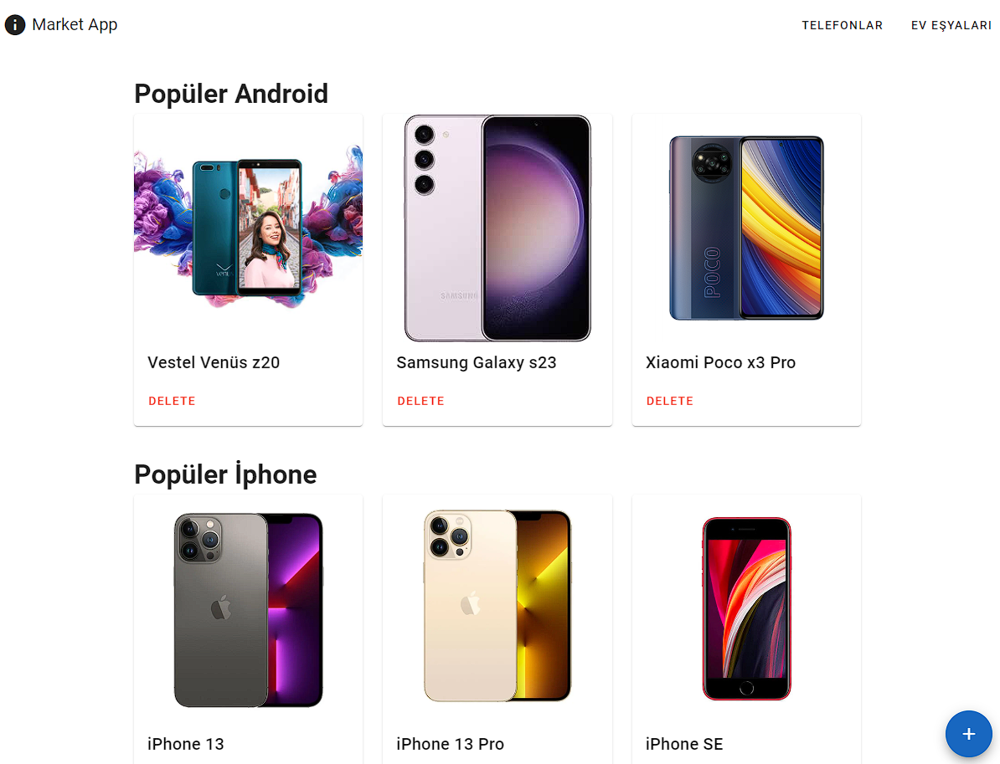

# Assignment

## Contents Of The Doc

- ### [Backend Docs](#backend)
  - [Docker Setup](#docker-setup)
  - [Manual Setup](#manually)
  - [API Documentation](#api)
    - [Category](#category)
    - [Product](#product)
- ### [Frontend Docs](#frontend)

---

### Task status:

- ~~Create new project using latest version of Fastify Typescript~~
- ~~Install latest version of VueJs using npm~~
- ~~Install any package support migration for database like prisma~~
- ~~Create categories tables using migration (id, name, picture, parent_id, created_at and updated_at)~~
- ~~Create products tables using migration (id, name, picture, category_id, created_at and updated_at)~~
- ~~Create CRUD api for categories~~
- ~~Show categories as tree~~
- ~~In categories list show count of products of recursive children categories~~
- ~~Create CRUD api for product~~
- ~~In product from show top parent categories and show children of selected category~~
- ~~Resize images while uploading to be 3200 \* 3200 inside~~
- ~~Add Delete button with confirmation message~~
- ~~Use MySQL only for database~~

Every api method is implemented. But category mutations are not implemented on **frontend**. Functionality exists but only on backend. It is implemented on products with delete and create.

---

# Backend

## Docker Setup

Run `docker compose up`;

## Manually

- npm i
- Configure `.env`'s `DATABASE_URL`.

- npm run db:migrate
- run run db:seed

- npm run build
- npm run start

or

- npm run dev

## API

You can add `postman.json`,

## Category

### Get categories [GET]

`{{baseUrl}}/category/get`

- Optional query params
  category_id: number ; If you want a specific category

It returns top categories and sub categories recursively and products inside of categories if exists.

### Update Category [POST]

`{{baseUrl}}/category/update`

- JSON

```json
{
  "id": "number",
  "name": "string"
}
```

### Delete categories [DELETE]

`{{baseUrl}}/category/delete`

- Query params

category_id: number

Give a query parameter to delete a category

### Create Category [POST]

`{{baseUrl}}/category/create`

- Form-Data

- file: File
- name: string
- parent_id: number? Optional, if you want a make this category sub category of another category

---

## Product

### Create Product [POST]

`{{baseUrl}}/product/create`

- Form-Data

- file File Picture of Product
- name: string Name of Product
- category_id: number Category ID of Product

### Update Product [POST]

`{{baseUrl}}/product/update`

- JSON

```json
{
  "id": "number",
  "name": "string"
}
```

### Get Products [GET]

`{{baseUrl}}/product/get`

- Query params

- category_id: number? Optional if you want all products

### Delete Product [DELETE]

`{{baseUrl}}/api/product/delete`

- Query params
  id: number

---

# Frontend

Since docker runs on port `3000` it's configured to connect that port. I could've dockerized this too but Im really short on time.

- `npm i`
- `npm run dev`

front is on port `3001`

### Main Page

Main page lists all of the categories with products. Categories on top clicked it will show sub categories of it.


